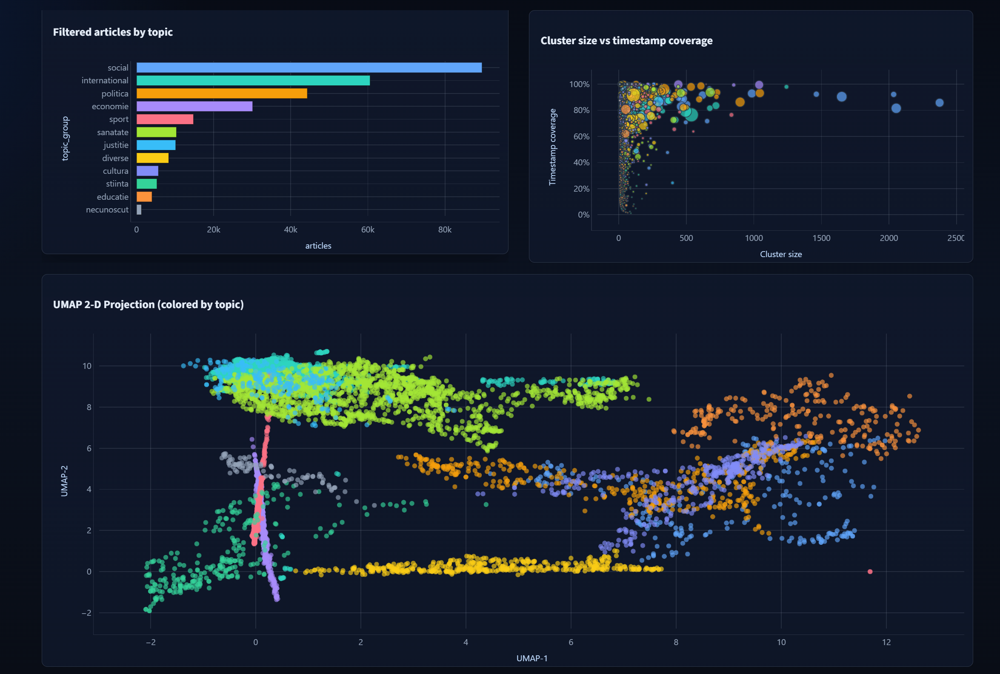
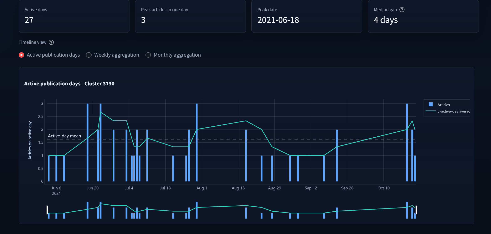
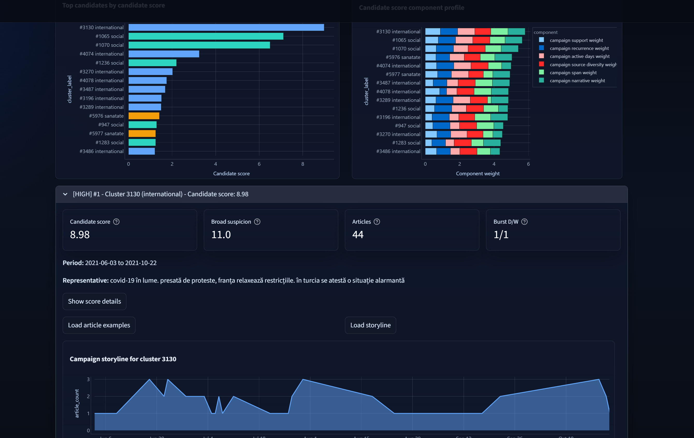
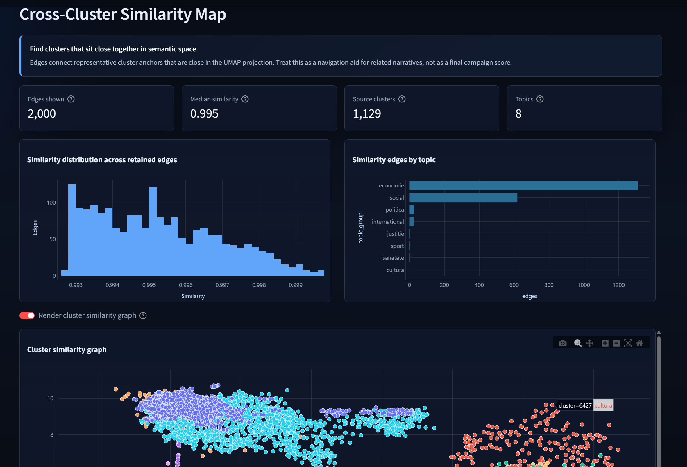
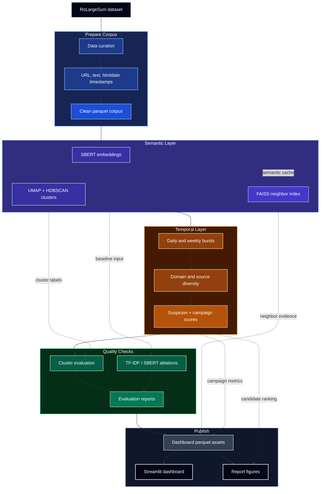

# Detecting Coordinated Campaigns in Romanian News

This repository detects suspicious coordinated news campaigns by combining
semantic clustering, temporal burst analysis, campaign-candidate scoring, and a
parquet-backed Streamlit dashboard.

Start here:

- [Pipeline guide](docs/PIPELINE_GUIDE.md) - detailed architecture and
  stage-by-stage data flow.
- [Report figures guide](report/figures/FIGURES.md) - generated figures, source
  data, and figure scripts.
- [Top 5 compact campaign candidates](report/figures/TOP_5_COMPACT_CAMPAIGN_CANDIDATES.md) -
  report-facing examples ranked by campaign-candidate score.
- [Requirements](requirements.txt) - pinned Python dependencies.
- [Environment template](.env.example) - Hugging Face token placeholder for the
  first data download.

## Dashboard Preview

The Streamlit dashboard is a dark-mode evidence browser for moving from corpus
overview to cluster-level articles. It can inspect topic coverage, semantic
cluster structure, temporal bursts, ranked campaign candidates, similarity
links, and quality/runtime diagnostics.

<!--markdownlint-disable MD033-->
<table>
  <tr>
    <td></td>
    <td></td>
  </tr>
  <tr>
    <td></td>
    <td></td>
  </tr>
</table>
<!--markdownlint-enable MD033-->

Additional diagnostic views:
[topic health](docs/images/dashboard-topic-health.png),
[runtime observability](docs/images/dashboard-runtime-observability.png), and
[evaluation/config sweep](docs/images/dashboard-evaluation-config.png).

## What The Pipeline Does



The project works in seven main stages:

1. [Data curation](scripts/DataCuration.py) downloads or loads RoLargeSum,
   cleans text, extracts timestamps from URL/text/htmldate, and writes cleaned
   parquet.
2. [Embeddings and clustering](scripts/EmbeddingsClustering.py) normalizes
   topics, creates SBERT embeddings, persists FAISS indexes and KNN edges, runs
   UMAP + HDBSCAN, and records runtime metrics.
3. [Temporal analysis](scripts/TemporalAnalysis.py) computes daily/weekly burst
   features, source/domain concentration, broad suspicion scores, and stricter
   campaign-candidate columns.
4. [Evaluation](scripts/Evaluation.py) combines HDBSCAN sweep results,
   intra-cluster cosine similarity, and temporal metrics.
5. [TF-IDF baseline](scripts/TFIDFBaseline.py) compares TF-IDF + KMeans, SBERT +
   KMeans, SBERT + HDBSCAN, and burst on/off ablations.
6. [Dashboard asset prep](scripts/PrepareDashboardData.py) builds fast parquet
   assets for Streamlit, including article details, timelines, neighbor
   evidence, cluster similarity, and runtime views.
7. [Dashboard](scripts/Dashboard.py) provides an interactive explorer for
   clusters, bursts, campaign candidates, similarity maps, topic health, and
   ablation results.

Shared code lives in [src/](src), including [configuration](src/config.py),
[paths](src/paths.py), [runtime profiling](src/runtime_profile.py),
[topic mapping](src/topic_mapping.py),
[date extraction](src/date_extraction.py), and
[campaign scoring](src/campaign_scoring.py).

## Setup

Use Python 3.11+ if possible. From the repository root:

```powershell
python -m venv .venv
.\.venv\Scripts\Activate.ps1
python -m pip install --upgrade pip
python -m pip install -r requirements.txt
```

On macOS/Linux, activate with:

```bash
python -m venv .venv
source .venv/bin/activate
python -m pip install --upgrade pip
python -m pip install -r requirements.txt
```

For the first run only, create `.env` from [.env.example](.env.example) and add
your Hugging Face token:

```text
HF_TOKEN=your_huggingface_token_here
```

The token is only needed when
[data/rolargesum_raw.parquet](data/rolargesum_raw.parquet) is absent and
[DataCuration.py](scripts/DataCuration.py) must download the dataset.

## Run The Full Pipeline

Run these commands from the repository root:

```powershell
python scripts/DataCuration.py
python scripts/EmbeddingsClustering.py
python scripts/TemporalAnalysis.py
python scripts/Evaluation.py
python scripts/TFIDFBaseline.py
python scripts/PrepareDashboardData.py
python -m streamlit run scripts/Dashboard.py
```

If you already have the parquet artefacts and only want to open the dashboard:

```powershell
python scripts/PrepareDashboardData.py
python -m streamlit run scripts/Dashboard.py
```

To regenerate report figures:

```powershell
python scripts/report_figures/run_all.py
```

## Useful Run Options

Small experiment run:

```powershell
python scripts/DataCuration.py --nrows 5000
python scripts/EmbeddingsClustering.py --nrows 5000
```

Force CPU or select a GPU backend for SBERT inference:

```powershell
python scripts/EmbeddingsClustering.py --device cpu
python scripts/EmbeddingsClustering.py --device cuda
python scripts/EmbeddingsClustering.py --device mps
python scripts/EmbeddingsClustering.py --device dml
```

Tune clustering/runtime helpers:

```powershell
python scripts/EmbeddingsClustering.py --cpu-threads 8 --embed-batch-size 128
python scripts/EmbeddingsClustering.py --disable-faiss
python scripts/EmbeddingsClustering.py --faiss-rebuild
python scripts/PrepareDashboardData.py --scatter-cap 25000 --noise-per-topic-cap 50
```

Optional post-hoc maintenance scripts:

```powershell
python scripts/apply_campaign_candidate_scoring.py --dry-run
python scripts/fix_multiyear_suspicion.py --dry-run
```

[TemporalAnalysis.py](scripts/TemporalAnalysis.py) already writes the current
campaign-candidate columns, so
[apply_campaign_candidate_scoring.py](scripts/apply_campaign_candidate_scoring.py)
is mainly useful when refreshing an existing temporal parquet after scoring
logic changes.

## Main Artefacts

Generated data is intentionally ignored by git. The important outputs are:

- [data/rolargesum_raw.parquet](data/rolargesum_raw.parquet) - cached Hugging
  Face dataset.
- [data/rolargesum_train_clean.parquet](data/rolargesum_train_clean.parquet) -
  cleaned text, timestamp fields, and document variants.
- [data/embeddings/](data/embeddings/) - per-topic SBERT `.npy` embedding
  caches.
- [data/faiss/](data/faiss/) - persisted per-topic FAISS indexes and metadata.
- [data/faiss/knn/](data/faiss/knn/) - per-topic nearest-neighbor edge parquet
  files.
- [data/clusters/clustered_data.parquet](data/clusters/clustered_data.parquet) -
  article-level cluster labels and UMAP coordinates.
- [data/clusters/hdbscan_config_results.parquet](data/clusters/hdbscan_config_results.parquet) -
  HDBSCAN sweep results.
- [data/clusters/runtime_observability.parquet](data/clusters/runtime_observability.parquet) -
  per-topic runtime breakdown.
- [data/temporal/cluster_temporal_stats.parquet](data/temporal/cluster_temporal_stats.parquet) -
  burst, suspicion, and campaign-candidate metrics.
- [data/evaluation_report.parquet](data/evaluation_report.parquet) -
  consolidated evaluation rows.
- [data/tfidf_ablation_report.parquet](data/tfidf_ablation_report.parquet) -
  baseline and ablation metrics.
- [data/dashboard/](data/dashboard/) - Streamlit-ready parquet assets.
- [report/figures/](report/figures/) - generated report PNGs and figure
  documentation.

Older CSV artefacts may exist locally from previous runs, but the current normal
pipeline is parquet-first.

## Optional NVIDIA GPU Support

The default dependency install may provide CPU-only PyTorch through
`sentence-transformers`. For NVIDIA acceleration, install a CUDA-enabled PyTorch
build that matches your system:

```powershell
python -m pip uninstall -y torch torchvision torchaudio
python -m pip install torch torchvision torchaudio --index-url https://download.pytorch.org/whl/cu128
python -c "import torch; print(torch.__version__, torch.cuda.is_available())"
```

If `torch.cuda.is_available()` prints `True`,
[EmbeddingsClustering.py](scripts/EmbeddingsClustering.py) will use CUDA
automatically with `--device auto`. Use the official selector if you need a
different build: <https://pytorch.org/get-started/locally/>

## Notes

- GPU acceleration is limited to SentenceTransformer embedding inference; UMAP,
  HDBSCAN, FAISS, temporal analysis, evaluation, ablations, dashboard prep, and
  figure generation are CPU-based.
- Runtime settings are auto-tuned by
  [src/runtime_profile.py](src/runtime_profile.py) and can be overridden with
  script flags.
- The dashboard expects prepared parquet assets by design, so run
  [PrepareDashboardData.py](scripts/PrepareDashboardData.py) after changing
  clustering, temporal, evaluation, or ablation outputs.
